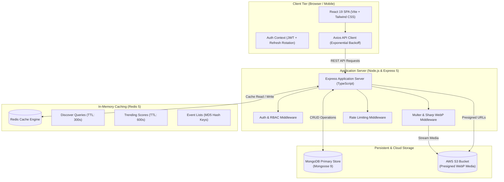
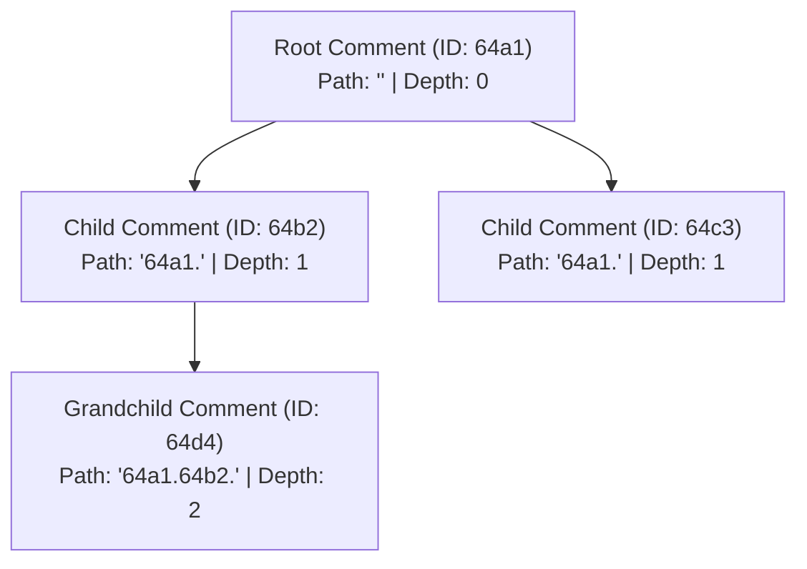
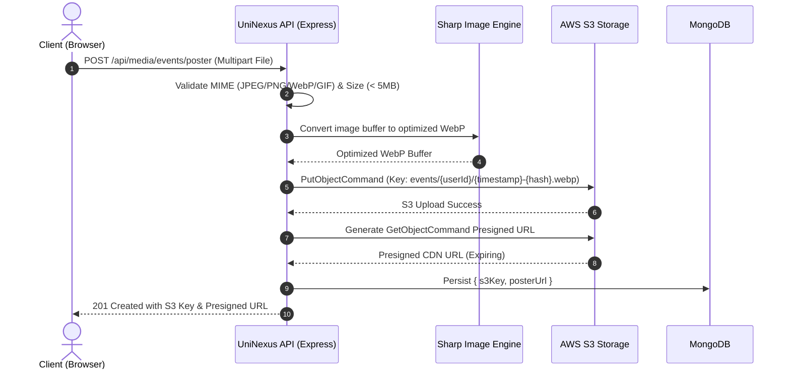
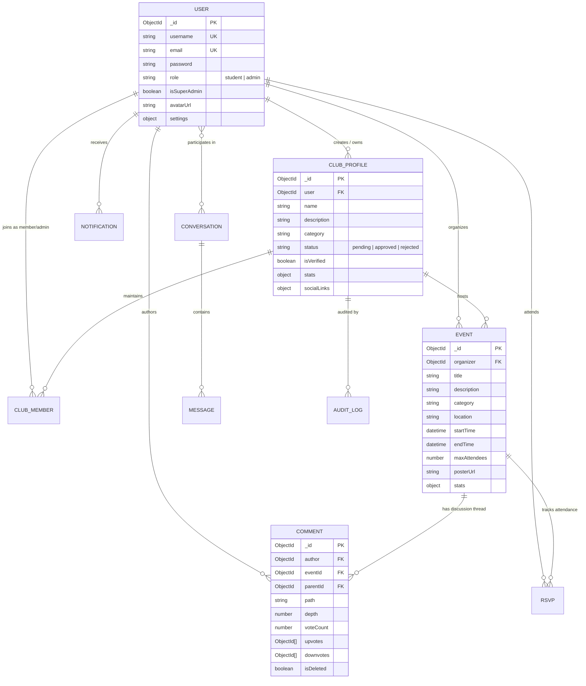

<div align="center">

# 🎓 UniNexus
### *The Unified Campus Event Discovery, Club Management & Real-Time Community Ecosystem*

[](https://www.typescriptlang.org/)
[](https://react.dev/)
[](https://nodejs.org/)
[](https://www.mongodb.com/)
[](https://redis.io/)
[](https://aws.amazon.com/s3/)
[](https://tailwindcss.com/)
[](https://jestjs.io/)
[](https://github.com/dubzzz/fast-check)
[](https://opensource.org/licenses/ISC)

<p align="center">
  <b>UniNexus</b> bridges the gap between students, student clubs, and campus administrators by consolidating scattered communication channels (WhatsApp chats, physical bulletin boards, Instagram stories) into a centralized, lightning-fast, and highly engaging digital campus hub.
</p>

---

</div>

## 📑 Table of Contents

- [🌟 Executive Overview](#-executive-overview)
- [✨ Core Capabilities](#-core-capabilities)
  - [1. Event Engine & Intelligent Discovery](#1-event-engine--intelligent-discovery)
  - [2. Interactive Reddit-Style Discussion Layer](#2-interactive-reddit-style-discussion-layer)
  - [3. Club Lifecycle & Roster Governance](#3-club-lifecycle--roster-governance)
  - [4. Student Social & Direct Messaging](#4-student-social--direct-messaging)
  - [5. Notification Dispatch Center](#5-notification-dispatch-center)
  - [6. Super-Admin Oversight & Audit Trails](#6-super-admin-oversight--audit-trails)
- [🏛️ System Architecture](#️-system-architecture)
  - [High-Level Topology](#high-level-topology)
  - [Materialized Path Discussion Flow](#materialized-path-discussion-flow)
  - [Media Pipeline & Presigned URLs](#media-pipeline--presigned-urls)
  - [Multi-Tier Caching & Invalidation](#multi-tier-caching--invalidation)
- [🛠️ Technology Stack](#️-technology-stack)
- [🗄️ Database Schemas & Data Model](#️-database-schemas--data-model)
- [📡 API Reference Directory](#-api-reference-directory)
- [🧪 Testing & Quality Assurance](#-testing--quality-assurance)
  - [Dual Testing Strategy](#dual-testing-strategy)
  - [Property-Based Testing (PBT) Highlights](#property-based-testing-pbt-highlights)
- [📁 Repository Structure](#-repository-structure)
- [🚀 Quickstart & Setup Guide](#-quickstart--setup-guide)
  - [Prerequisites](#prerequisites)
  - [Backend Setup](#backend-setup)
  - [Frontend Setup](#frontend-setup)
  - [Environment Variables Guide](#environment-variables-guide)
  - [Database Seeding & Super-Admin Setup](#database-seeding--super-admin-setup)
- [⚙️ Available Scripts](#️-available-scripts)
- [🔒 Security & Performance Features](#-security--performance-features)
- [🤝 Contributing Guidelines](#-contributing-guidelines)
- [📄 License](#-license)

---

## 🌟 Executive Overview

Universities suffer from extreme information fragmentation. Campus events, hackathons, cultural fests, club recruitments, and student discussions are dispersed across ephemeral chat groups, social media algorithms, and paper flyers.

**UniNexus** delivers a single pane of glass for collegiate life:
- **Centralized Campus Pulse**: Real-time event discovery with category filtering, time-window queries, and rich media assets.
- **Deep Community Engagement**: Nested, multi-level threaded discussions per event powered by the MongoDB *Materialized Path Pattern* with atomic voting.
- **Club Administration**: Club verification pipelines, hierarchical role delegation (Owner, Admin, Member), and member roster management.
- **Intelligent Ranking**: Proprietary engagement formulas scoring events and clubs based on attendance, recency bonuses, and viewer activity.
- **Enterprise-Grade Foundation**: Strict TypeScript backend, dual-token JWT rotation, Redis caching layer with MD5 query hashing, AWS S3 image pipeline with Sharp WebP optimization, and comprehensive fast-check property-based test suites.

---

## ✨ Core Capabilities

### 1. Event Engine & Intelligent Discovery
- **Comprehensive Event CRUD**: Clubs can publish events with start/end schedules, venue details, participant caps, tags, and optimized promotional banners.
- **Dynamic Filters**: Instant filtering by category (`Tech`, `Cultural`, `Sports`, `Workshop`, `Seminar`, `Other`) and temporal windows (`Today`, `This Week`, `This Month`, `Upcoming`).
- **RSVP Tracking**: One-click RSVP states (`Going`, `Interested`, `Waitlist`, `Not Going`) with live attendee counting and user schedule aggregation (`/api/rsvp/my-rsvps`).
- **Multi-Vector Discovery**: Unified search combining full-text regex scanning across event titles, descriptions, club names, and category classifications.

### 2. Interactive Reddit-Style Discussion Layer
- **Infinite Nesting via Materialized Paths**: Comments store hierarchical ancestry strings (`GrandparentID.ParentID.`), enabling complex discussion trees to be fetched in a single database read without recursive queries.
- **Atomic Voting Engine**: Reddit-style upvoting and downvoting with vote-toggling, automatic count reconciliation, and vote uniqueness enforcement.
- **Thread Management**: Collapsible parent threads, local storage persistence for sort orders (`hot`, `new`, `top`), and moderation controls (soft deletion with reason tracking).

### 3. Club Lifecycle & Roster Governance
- **Club Registration & Verification**: Students apply for club creation; applications enter a `pending` state awaiting Super-Admin verification.
- **Dual-Tier Club RBAC**:
  - **Club Owner**: Full profile control, event creation, member role management, club deletion.
  - **Club Admin**: Member approval, role assignment, event editing.
  - **Club Member**: Official club affiliation, participation access.
- **Rich Profiles**: Social link aggregation (Instagram, LinkedIn, Twitter, Facebook, Medium, Reddit, custom website), member counts, and event archives.

### 4. Student Social & Direct Messaging
- **1-on-1 Direct Messaging**: Private student-to-student conversations with conversation search, message status tracking, and unread counters.
- **Instant Conversation Initiation**: Start chats directly from user search results or club rosters.
- **User Discovery**: Searchable student directory by name, major, and graduation year.

### 5. Notification Dispatch Center
- **Multi-Channel Alerts**: Granular notifications for event reminders, club approval statuses, direct messages, and system announcements.
- **Real-Time Notification Bar**: Unread badge indicators, interactive dropdown view, single-click "Mark All as Read", and individual dismissal.

### 6. Super-Admin Oversight & Audit Trails
- **Super-Admin Console**: Dedicated administrative portal (`/admin/dashboard`) to evaluate pending club registrations, review application notes, and approve or reject with feedback.
- **Immutable Audit Logging**: Automatic record creation for critical security and administrative actions (`member_added`, `member_removed`, `role_changed`, `club_approved`, `club_rejected`, `comment_moderated`).

---

## 🏛️ System Architecture

### High-Level Topology



---

### Materialized Path Discussion Flow

Instead of nested arrays or recursive database lookups, comments use materialized string paths:



*Query Benefit*: Fetching all replies for a sub-thread requires only a single index-backed regex/prefix query: `path: /^64a1.64b2./`.

---

### Media Pipeline & Presigned URLs



---

### Multi-Tier Caching & Invalidation

1. **Deterministic Filter Hashing**: Request query filters are sorted alphabetically and hashed with MD5 (`crypto.createHash('md5')`) to generate deterministic cache keys (`events:list:<hash>`, `discover:search:<hash>`).
2. **Graceful Degradation**: If Redis is offline or disconnected, the backend logs a diagnostic warning and queries MongoDB directly without dropping requests.
3. **Targeted Invalidation**: Creating, updating, or deleting an event or club triggers pattern-based cache purging (`events:*`, `trending:*`, `discover:*`).

---

## 🛠️ Technology Stack

| Domain | Technology | Version | Purpose |
| :--- | :--- | :--- | :--- |
| **Frontend Framework** | React | `^19.2.0` | Declarative UI rendering & state orchestration |
| **Build System** | Vite | `^7.2.4` | Blazing fast HMR and optimized production bundles |
| **Routing** | React Router DOM | `^7.12.0` | Client-side nested and protected routing |
| **Styling** | Tailwind CSS / PostCSS | `^3.4.17` | Responsive utility-first design system |
| **UI Components** | Lucide React | `^0.562.0` | Clean, modern iconography |
| **Virtualization** | react-window | `^2.2.7` | High-performance virtualized lists for large datasets |
| **Backend Framework**| Node.js / Express | `^5.2.1` | REST API layer and middleware pipeline |
| **Language** | TypeScript | `^5.9.3` | Type safety, interfaces, and strict compiler enforcement |
| **Primary Database** | MongoDB / Mongoose | `^9.1.2` | Document database with compound indexing |
| **In-Memory Cache** | Redis / ioredis | `^5.9.2` | High-speed response caching and key expiration |
| **Cloud Media** | AWS SDK S3 | `^3.975.0` | Object storage with presigned URLs |
| **Image Processing** | Sharp | `^0.34.5` | Dynamic image compression and WebP conversion |
| **Schema Validation**| Zod | `^4.3.5` | Strict runtime request and data validation |
| **Authentication** | JWT & bcryptjs | `^9.0.3` / `^3.0.3` | Dual access/refresh tokens with 12 salt rounds |
| **Backend Testing** | Jest & ts-jest | `^30.2.0` | Test runner for unit, integration, and property tests |
| **Frontend Testing**| Vitest & RTL | `^4.0.18` | React component and integration test suite |
| **In-Memory DB Test**| mongodb-memory-server| `^11.0.1` | Zero-dependency isolated database for testing |
| **Property Testing** | fast-check | `^4.5.3` | Generative testing running 100+ runs per property |

---

## 🗄️ Database Schemas & Data Model



### Key Database Indexes

| Collection | Indexed Fields | Index Type | Rationale |
| :--- | :--- | :--- | :--- |
| **User** | `{ email: 1 }`, `{ username: 1 }` | Unique | Fast authentication and registration uniqueness |
| **ClubProfile** | `{ user: 1 }` | Unique | Enforces 1:1 club ownership per account |
| **ClubProfile** | `{ status: 1, isVerified: 1 }` | Compound | Admin filtering and public verified club queries |
| **ClubMember** | `{ userId: 1, clubId: 1 }` | Compound Unique | Prevents duplicate memberships |
| **Event** | `{ isPublic: 1, startTime: 1 }` | Compound | Chronological public event feed queries |
| **Comment** | `{ eventId: 1, path: 1 }` | Compound | Materialized path hierarchy retrieval |
| **Comment** | `{ eventId: 1, voteCount: -1 }` | Compound | "Top" and "Hot" comment sorting |
| **RSVP** | `{ user: 1, event: 1 }` | Compound Unique | Single RSVP status per user-event pair |
| **Notification** | `{ userId: 1, read: 1, createdAt: -1 }` | Compound | User inbox querying and unread counts |
| **AuditLog** | `{ clubId: 1, timestamp: -1 }` | Compound | Chronological club compliance auditing |

---

## 📡 API Reference Directory

### 🔐 Authentication (`/api/auth`)
| Method | Endpoint | Access | Description |
| :--- | :--- | :--- | :--- |
| `POST` | `/api/auth/register` | Public | Register student/admin account with strong password checks |
| `POST` | `/api/auth/login` | Public | Authenticate user, return JWT access and refresh tokens |
| `POST` | `/api/auth/refresh` | Public | Rotate and issue new access token using refresh token |
| `POST` | `/api/auth/logout` | Authenticated | Invalidate refresh token and end session |

### 👤 User Management & Profiles (`/api/users`)
| Method | Endpoint | Access | Description |
| :--- | :--- | :--- | :--- |
| `GET` | `/api/users/profile` | Authenticated | Retrieve authenticated user's profile |
| `PUT` | `/api/users/profile` | Authenticated | Update user bio, year, major, first/last name |
| `GET` | `/api/users/search` | Authenticated | Search students for direct messaging or club invites |
| `GET` | `/api/users` | Admin | List all registered users (admin only) |

### 🏛️ Club Operations (`/api/clubs`)
| Method | Endpoint | Access | Description |
| :--- | :--- | :--- | :--- |
| `GET` | `/api/clubs` | Public | List verified clubs with category filters and search |
| `GET` | `/api/clubs/me` | Authenticated | Fetch club profile managed by the logged-in user |
| `GET` | `/api/clubs/:id` | Public | Get full club details, statistics, and social links |
| `POST` | `/api/clubs` | Authenticated | Submit a new club registration for admin review |
| `PUT` | `/api/clubs` | Club Owner | Update club bio, category, contact info, social links |
| `DELETE` | `/api/clubs` | Club Owner | Remove club profile and associated resources |
| `POST` | `/api/clubs/:id/join` | Authenticated | Join a club as a student member |
| `DELETE` | `/api/clubs/:id/leave`| Authenticated | Leave a club |
| `GET` | `/api/clubs/:id/members`| Public | Fetch member roster for a club |
| `POST` | `/api/clubs/:id/members`| Club Admin | Add member directly to club |
| `DELETE` | `/api/clubs/:id/members/:userId` | Club Admin | Remove member from club roster |
| `PUT` | `/api/clubs/:id/members/:userId/role` | Club Admin | Promote / demote member (`admin` / `member`) |

### 📅 Event Management (`/api/events`)
| Method | Endpoint | Access | Description |
| :--- | :--- | :--- | :--- |
| `GET` | `/api/events` | Public | List upcoming events with category and date filtering |
| `GET` | `/api/events/:id` | Public | Get event detail, organizer details, and metrics |
| `POST` | `/api/events` | Club Owner | Create a new campus event |
| `PUT` | `/api/events/:id` | Event Organizer | Edit event details, schedule, or capacity |
| `DELETE` | `/api/events/:id` | Event Organizer | Cancel and remove an event |

### 🎟️ Event RSVPs (`/api/rsvp`)
| Method | Endpoint | Access | Description |
| :--- | :--- | :--- | :--- |
| `POST` | `/api/rsvp/events/:eventId` | Authenticated | Set RSVP state (`going`, `interested`, `not_going`) |
| `GET` | `/api/rsvp/my-rsvps` | Authenticated | Get all events RSVP'd by the current user |
| `GET` | `/api/rsvp/events/:eventId` | Public | Get attendee count and user list for an event |
| `DELETE`| `/api/rsvp/events/:eventId` | Authenticated | Cancel RSVP for an event |

### 💬 Threaded Comments (`/api/comments`)
| Method | Endpoint | Access | Description |
| :--- | :--- | :--- | :--- |
| `GET` | `/api/comments/event/:eventId` | Public | Fetch threaded comments tree with sorting (`hot`, `new`, `top`)|
| `POST` | `/api/comments` | Authenticated | Post root comment or reply to parent via materialized path |
| `PUT` | `/api/comments/:id` | Author | Edit comment content |
| `DELETE`| `/api/comments/:id` | Author/Mod | Soft-delete comment with moderation log |
| `POST` | `/api/comments/:id/vote` | Authenticated | Cast or toggle `upvote` / `downvote` (Rate Limited) |

### 🔍 Discovery & Trending (`/api/discover` & `/api/trending`)
| Method | Endpoint | Access | Description |
| :--- | :--- | :--- | :--- |
| `GET` | `/api/discover` | Public | Multi-entity search across events and clubs (Cached 300s) |
| `GET` | `/api/trending` | Public | Algorithmic trending events & clubs (Cached 600s) |

### ✉️ Messaging & Notifications (`/api/messages` & `/api/notifications`)
| Method | Endpoint | Access | Description |
| :--- | :--- | :--- | :--- |
| `GET` | `/api/messages/conversations` | Authenticated | List 1-on-1 conversations ordered by recency |
| `GET` | `/api/messages/conversations/:id` | Authenticated | Get full message history in a conversation |
| `POST` | `/api/messages` | Authenticated | Send a direct message |
| `POST` | `/api/messages/conversations` | Authenticated | Create a new direct conversation thread |
| `GET` | `/api/notifications` | Authenticated | Retrieve user notifications with unread counts |
| `PUT` | `/api/notifications/:id/read` | Authenticated | Mark individual notification as read |
| `PUT` | `/api/notifications/read-all` | Authenticated | Bulk mark all notifications as read |

### 🛡️ Administration & Media (`/api/admin` & `/api/media`)
| Method | Endpoint | Access | Description |
| :--- | :--- | :--- | :--- |
| `GET` | `/api/admin/clubs/stats` | Super-Admin | Overall platform club statistics |
| `GET` | `/api/admin/clubs/pending` | Super-Admin | Review queue of pending club applications |
| `POST` | `/api/admin/clubs/:id/approve` | Super-Admin | Approve club and grant active status |
| `POST` | `/api/admin/clubs/:id/reject` | Super-Admin | Reject club with required reason note |
| `POST` | `/api/media/users/profile-picture` | Authenticated | Upload profile picture to S3 with WebP conversion |
| `POST` | `/api/media/clubs/:id/logo` | Authenticated | Upload club logo to S3 |
| `POST` | `/api/media/events/poster` | Authenticated | Upload event banner poster to S3 |
| `GET` | `/api/media/presigned-url` | Authenticated | Request presigned S3 download/view URL |

---

## 🧪 Testing & Quality Assurance

UniNexus employs a **Dual Testing Strategy** ensuring rock-solid stability across critical campus operations.

### Dual Testing Strategy

1. **Unit & Integration Testing (Jest & Vitest)**:
   - Validates specific functional workflows, controller routes, authorization barriers, and UI rendering.
   - Tests execute against an isolated, in-memory database using `mongodb-memory-server`, ensuring zero side effects between test runs.

2. **Property-Based Testing (fast-check)**:
   - Evaluates universal domain invariants over **100+ randomized iterations** per test suite.
   - Discovers subtle edge cases in depth calculations, voting uniqueness, authorization matrix transitions, and data sanitization that manual test cases miss.

```bash
# Run all backend tests
cd backend && npm test

# Run property-based tests only
cd backend && npm run test:pbt

# Run unit tests only
cd backend && npm run test:unit

# Run test coverage report
cd backend && npm run test:coverage

# Run frontend tests
cd frontend && npm run test:run
```

---

## 📁 Repository Structure

```
UniNexus/
├── backend/
│   ├── src/
│   │   ├── config/              # MongoDB, Redis, and AWS S3 configurations
│   │   ├── controllers/         # Express controllers (auth, clubs, events, comments, admin)
│   │   ├── middlewares/         # Auth, RBAC, file upload, rate-limiting, and error handlers
│   │   ├── models/              # Mongoose data schemas (User, Event, ClubProfile, Comment, etc.)
│   │   ├── routes/              # Express route declarations
│   │   ├── scripts/             # Database seeding, Super-Admin bootstrap, diagnostic tools
│   │   ├── services/            # Core business logic (authService, cacheService, mediaService)
│   │   ├── types/               # Express type extensions and TypeScript definitions
│   │   ├── utils/               # Logger, token helpers, path calculations, error formatting
│   │   ├── validation/          # Zod schema validators for requests
│   │   └── server.ts            # Application server bootstrap & graceful shutdown hooks
│   ├── tests/
│   │   ├── generators/          # fast-check randomized data generators
│   │   ├── globalSetup.ts       # In-memory MongoDB initialization
│   │   ├── globalTeardown.ts    # Cleanup and memory server termination
│   │   └── *.test.ts            # 40+ unit, integration, and property-based test suites
│   ├── .env.example             # Backend environment template
│   ├── jest.config.js           # Jest and ts-jest configuration
│   ├── package.json             # Backend dependencies & script definitions
│   └── tsconfig.json            # Strict TypeScript compiler options
├── frontend/
│   ├── public/                  # Static assets & Service Worker scripts
│   ├── src/
│   │   ├── api/                 # API endpoint interfaces
│   │   ├── components/
│   │   │   ├── common/          # ErrorBoundary, ImageUpload, VirtualList, ConfirmDialog
│   │   │   ├── layout/          # Layout, Navbar, Sidebar with responsive state
│   │   │   └── specific/        # CommentThread, EventCreationForm, MemberManagement
│   │   ├── context/             # AuthContext, ThemeContext, SidebarContext
│   │   ├── pages/               # Home, Events, EventDetails, Clubs, MyClub, AdminDashboard, etc.
│   │   ├── services/            # Axios instance with token refresh & exponential retry
│   │   ├── App.jsx              # Root component with code-split lazy routes
│   │   ├── main.jsx             # React entry point
│   │   └── index.css            # Tailwind CSS directives and custom styling
│   ├── .env                     # Frontend environment configuration
│   ├── tailwind.config.js       # Tailwind CSS theme configuration
│   ├── vite.config.js           # Vite server, proxy, and Rollup chunking rules
│   └── vitest.config.js         # Vitest UI & testing setup
└── README.md                    # Project documentation
```

---

## 🚀 Quickstart & Setup Guide

### Prerequisites

- **Node.js**: `v18.x` or higher
- **npm** or **yarn**
- **MongoDB**: Local MongoDB instance (`v6.0+`) or MongoDB Atlas cluster URI
- **Redis** *(Optional for local dev)*: Local Redis instance (`v6.0+`) on port `6379`
- **AWS S3 Bucket** *(Optional for local dev)*: For cloud image uploads

---

### Backend Setup

1. **Navigate to the backend directory**:
   ```bash
   cd backend
   ```

2. **Install dependencies**:
   ```bash
   npm install
   ```

3. **Configure environment variables**:
   ```bash
   cp .env.example .env
   ```
   *Edit `.env` with your MongoDB URI, JWT secret, and optional Redis/AWS credentials.*

4. **Seed sample campus data** *(Optional but recommended)*:
   ```bash
   npm run seed
   ```

5. **Start backend development server**:
   ```bash
   npm run dev
   ```
   The backend API will run at `http://localhost:5000` (or your configured `PORT`).

---

### Frontend Setup

1. **Navigate to the frontend directory**:
   ```bash
   cd frontend
   ```

2. **Install dependencies**:
   ```bash
   npm install
   ```

3. **Verify `.env` configuration**:
   ```env
   VITE_API_BASE_URL=http://localhost:5000/api
   BACKEND_PORT=5000
   ```

4. **Start frontend development server**:
   ```bash
   npm run dev
   ```
   The frontend application will run at `http://localhost:5173`.

---

### Environment Variables Guide

#### `backend/.env`
```env
# Application Server
PORT=5000
NODE_ENV=development
JWT_SECRET=super_secret_jwt_key_change_in_production
JWT_REFRESH_SECRET=super_secret_refresh_key_change_in_production

# Database Connection
MONGO_URI=mongodb://localhost:27017/uninexus

# Redis Caching (Non-blocking fallback if unavailable)
REDIS_HOST=localhost
REDIS_PORT=6379
REDIS_PASSWORD=
REDIS_DB=0
CLEAR_REDIS_ON_START=false

# AWS S3 Cloud Media Pipeline
AWS_REGION=us-east-1
AWS_ACCESS_KEY_ID=your_aws_access_key
AWS_SECRET_ACCESS_KEY=your_aws_secret_key
S3_BUCKET_NAME=uninexus-media
```

#### `frontend/.env`
```env
VITE_API_BASE_URL=/api
BACKEND_PORT=5000
```

---

### Database Seeding & Super-Admin Setup

UniNexus comes with built-in scripts to bootstrap a full campus demo environment:

```bash
# Seed 10+ students, clubs, events, discussions, and RSVPs
cd backend && npm run seed

# Elevate a user account to Super-Admin
cd backend && npm run script:setSuperAdmin <user_email>

# Verify MongoDB Atlas connection and cluster health
cd backend && npm run atlas:status
```

---

## ⚙️ Available Scripts

### Backend Scripts (`backend/package.json`)
- `npm run dev`: Start backend in watch mode using `nodemon` and `ts-node`.
- `npm run build`: Compile TypeScript into production JavaScript in `dist/`.
- `npm start`: Launch the production build.
- `npm test`: Run full Jest test suite across unit, integration, and PBT tests.
- `npm run test:pbt`: Run only Property-Based Tests (`fast-check`).
- `npm run test:coverage`: Generate code coverage reports.
- `npm run seed`: Populate database with sample users, clubs, events, and discussions.
- `npm run lint`: Run ESLint across TypeScript codebase.

### Frontend Scripts (`frontend/package.json`)
- `npm run dev`: Start Vite development server with hot module replacement.
- `npm run build`: Build production assets with Terser minification and chunk splitting.
- `npm run preview`: Locally preview production build.
- `npm run test:run`: Execute Vitest unit and component tests.
- `npm run lint`: Run ESLint over React components and hooks.

---

## 🔒 Security & Performance Features

- 🛡️ **Dual-Token JWT Strategy**: Short-lived access tokens with automatic silent refresh rotation via Axios interceptors and secure HTTP storage.
- 🔐 **Password Hardening**: Enforced password entropy (uppercase, lowercase, numbers, special characters) hashed with bcrypt `12` salt rounds.
- 🧹 **XSS & Injection Protection**: HTML sanitization on comment submissions and Zod schema validation across incoming API payloads.
- 🚦 **Rate Limiting**: Custom Redis-backed and Express rate limiters on sensitive actions like voting and comment creation.
- ⚡ **Optimized Asset Pipeline**: Automated conversion to WebP format via `Sharp` prior to S3 upload, reducing media footprint by up to 70%.
- 📜 **Virtual Scrolling**: `react-window` integration on heavy list pages to maintain a smooth 60 FPS scrolling experience.

---

## 🤝 Contributing Guidelines

1. **Fork the Repository** & create a feature branch (`git checkout -b feat/campus-feature`).
2. **Adhere to Code Standards**:
   - Backend: Strict TypeScript, Mongoose models, and comprehensive fast-check property tests.
   - Frontend: Clean React components, Tailwind styling, and Lucide icons.
3. **Follow Conventional Commits**:
   - `feat: add Google Calendar export for RSVPs`
   - `fix: resolve depth calculation in nested comment threads`
   - `test: add property test for club role transitions`
4. **Submit a Pull Request** with a detailed summary of changes and test verification steps.

---

## 📄 License

This project is licensed under the **ISC License**. See the LICENSE file for details.

<div align="center">
  <sub>Built with ❤️ for universities and student communities worldwide.</sub>
</div>
